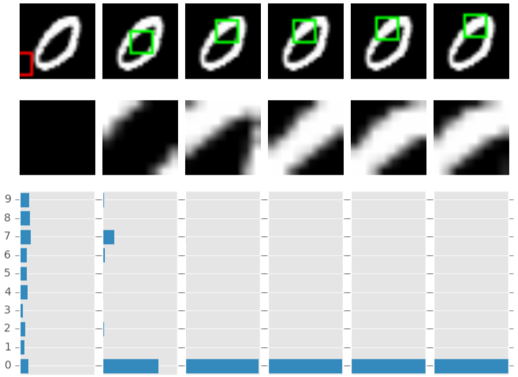
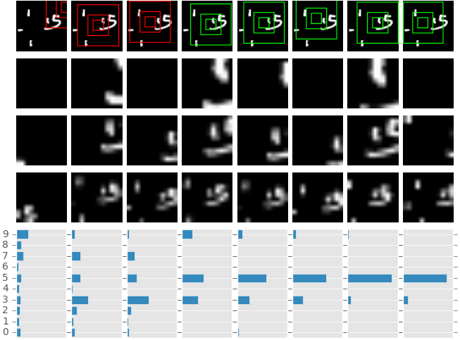

# Recurrent Attention Model

Recurrent Attention Model with Chainer based on the following paper  
[arXiv:1406.6247](http://arxiv.org/abs/1406.6247): Recurrent Models of Visual Attention [Volodymyr Mnih+ 2014]  

## Features  

* RAM model difinition on Chainer  
* script to train RAM & infer with RAM 
* translated MNIST & translated and cluttered MNIST task

### not yet implemented  

* hyper-parameters to get the best scores in the paper  

## Examples  
  
  

## Dependencies  
Python(2 or 3), Chainer, PIL, matplotlib, tqdm  

## Usage  

train.py: train a model (with --original) for 28x28 original MNIST task, with --translated for 60x60 translated MNIST, and --cluttered for 60x60 translated and cluttered MNIST
```shellsession
➜ python train.py --original  
```
If you use a GPU, add the option "-g your_GPU_device_ID".  

After training, you can get inferences by a trained model.  
The result shows up with your matplotlib's backend.  

```shellsession
➜ python infer.py --original -m ram_*.chainermodel  
```
