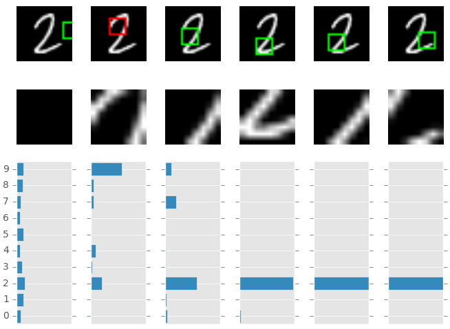
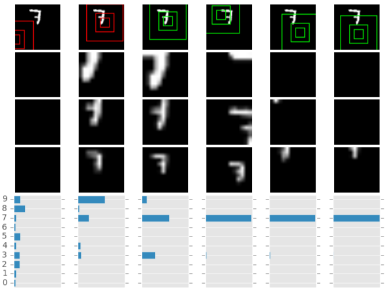
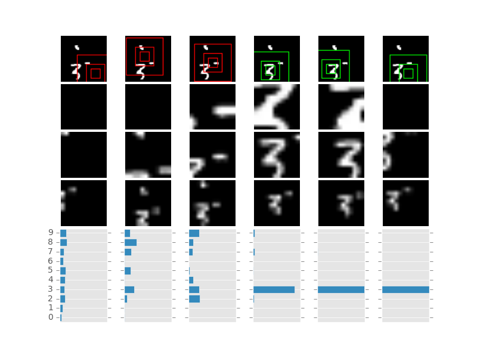

# Recurrent Attention Model

Recurrent Attention Model with Chainer based on the following paper  
[arXiv:1406.6247](http://arxiv.org/abs/1406.6247): Recurrent Models of Visual Attention [Volodymyr Mnih+ 2014]  

## Features  

* RAM model difinition on Chainer  
* script to train RAM and infer with RAM 
* Translated MNIST and Cluttered Translated MNIST  
* 1.13% error on 28x28 MNIST (RAM, 6 glimpses, 8x8, 1 scale)  
* 1.58% error on 60x60 Translated MNIST (RAM, 6 glimpses, 12x12, 3 scales)  
* 5.30% error on 60x60 Cluttered Translated MNIST (RAM, 6 glimpses, 12x12, 3 scales)  

## Examples  

glimpses and output probabilities at each time step  

* Original MNIST  

  

* Translated MNIST  

  

* Cluttered Translated MNIST  

  


## Dependencies  
Python(2 or 3), Chainer, PIL, matplotlib, tqdm  

## Usage  
train.py: optimizes weights of a RAM model and ouputs learned weights to \*.chainermodel file every 100 epoch

* with "--original" for 28x28 original MNIST task, "--translated" for 60x60 translated MNIST, and "--cluttered" for 60x60 cluttered translated MNIST  
* training for Cluttered Translated MNIST will take around a day with CPU
* train on CPU with default setting or GPU with "-g YOUR_GPU_DEVICE_ID"

```shellsession
➜ python train.py --original  
```

infer.py: plot result of inference by a trained RAM model (result will show up with your matplotlib's backend)  

```shellsession
➜ python infer.py --original -m models/ram_original_epoch800.chainermodel  
```
