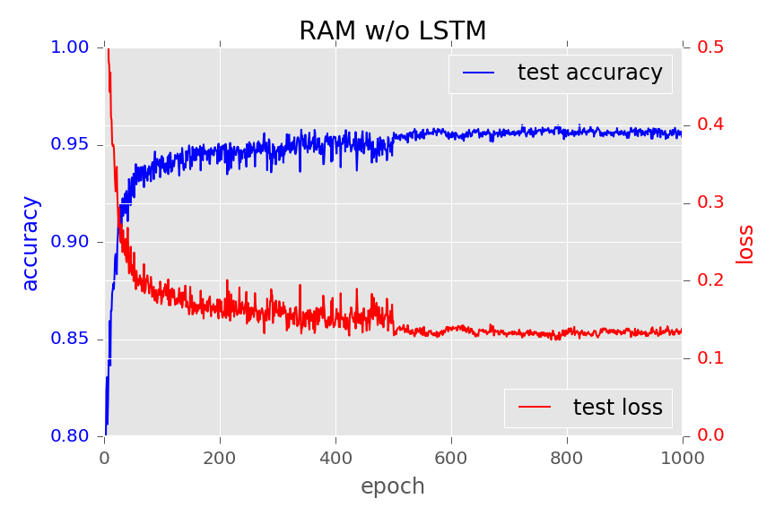

# Reccurent Attention Model

## Reccurent Attention Model
Reccurent Attention Model with Chainer based on the following paper  
[arXiv:1406.6247](http://arxiv.org/abs/1406.6247): Recurrent Models of Visual Attention [Volodymyr Mnih+ 2014]  

## Features  

* RAM model difinition file (Chainer)  
* script for training the model  

not implemented yet 
** visualize the locations model predicted  
** multi-scale glimpse  
** models to solve "Translated MNIST" task  

## Dependencies  
Python(2 or 3), Chainer, scikit-learn, tqdm  

## Usage  

```shellsession
➜ python train_wolstm.py -g -1  
```




