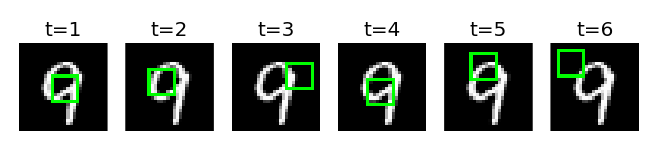
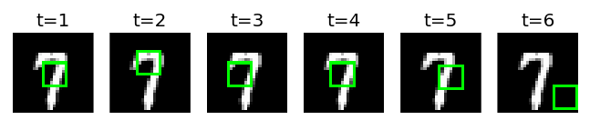
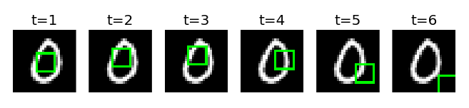

# Reccurent Attention Model

Reccurent Attention Model with Chainer based on the following paper  
[arXiv:1406.6247](http://arxiv.org/abs/1406.6247): Recurrent Models of Visual Attention [Volodymyr Mnih+ 2014]  

## Features  

* RAM model difinition file  
* script to train the model on MNIST  
* script to run the model on MNIST  

### not yet implemented  

* hyper-parameters to get the best accuracy in the paper  
* multi-scale glimpse  
* models to solve "Translated MNIST" & "Translated Cluttered" tasks  

## Examples  




## Dependencies  
Python(2 or 3), Chainer, scikit-learn, PIL, matplotlib, tqdm  

## Usage  

```shellsession
➜ python train.py   
```

If you use a GPU, add the option "-g `deviceID`".  
When you use LSTM units in core RNN layer, add the option "--lstm".  
(better performance but a little time consuming with LSTMs)  

```shellsession
➜ python train.py -g 0 --lstm  
```

After training, you can get inferences by the trained model.  
The results may not show up (with matplotlib) depend on the environment.  

```shellsession
➜ python infer.py -m ram.chainermodel  
```
